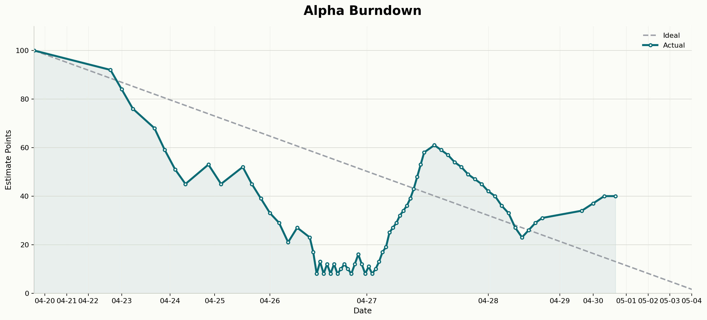

# Alpha Burndown



本分支只用于展示 Alpha 阶段燃尽图，不包含 Godot 项目代码。迭代周期为 2026-04-20 至 2026-05-04，理想线从 100 points 线性下降到 0 points。

由于仓库在 2026-04-23 才完成初始化，脚本会把 2026-04-23 及之前创建的首批 issue 视作 2026-04-20 已存在的初始工作量，并将这批 issue 的估点归一到总计 100。之后新增的 issue 不再凑总数，而是按新增问题本身的复杂度估点：小 bug 通常为 2-3 points，普通 UI 或数值调整为 2-4 points，较完整的新功能为 5-8 points。

实际线使用连续折线，并只绘制到图表生成日期；理想线仍覆盖完整 04-20 到 05-04 周期。为了避免 issue 变动密集的日期挤在一起，横轴采用“事件密度缩放”：日期范围仍覆盖 04-20 到 05-04，但当天 issue 创建/关闭事件越多，该日期在图上占用的横向空间越大，低事件日期占用空间更少。

## 文件结构

```text
.
├── README.md
├── alpha_burndown.py
├── requirements-alpha-burndown.txt
└── burndowns/
    ├── alpha_burndown.png
    └── alpha_burndown_issues.json
```

## Estimate 标签

每个 issue 使用 `estimate:N` 标签记录估点，例如 `estimate:3`。这种格式便于脚本直接解析，也方便后续手工调整。

## 重新生成

需要本机已通过 GitHub CLI 登录，并具备仓库 issue 写权限：

```powershell
python -m pip install --target .local\python-packages -r requirements-alpha-burndown.txt
python alpha_burndown.py --sync --force-estimates
```

输出文件：

- `burndowns/alpha_burndown.png`
- `burndowns/alpha_burndown_issues.json`
