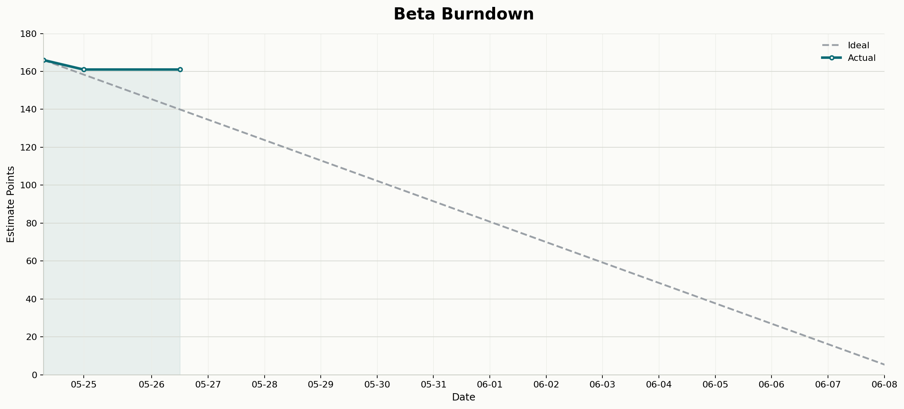

# Beta Burndown



本分支只用于展示 Beta 阶段燃尽图，不包含 Godot 项目代码。迭代周期为 2026-05-25 至 2026-06-08，理想线会从首日实际总估点线性下降到 0 points。

由于 `Beta` milestone 下的大量 issue 在 2026-05-26 才集中创建，脚本会把 2026-05-26 及之前创建的 Beta issue 视作 2026-05-25 已存在的初始工作量。这样燃尽图会从 2026-05-25 正确反映整批 Beta 工作，而不是把这些 issue 误判成第二天突然新增。

每次生成时会同时写出两类图片：

- `burndowns/YYYY-MM-DD.png`：按生成日期归档，便于保留每天快照
- `burndowns/newest.png`：始终覆盖为最新一张，供 `README.md` 直接引用展示

此外还会更新 `burndowns/beta_burndown_issues.json`，记录当次生成时的 issue 状态与估点快照。

## 文件结构

```text
.
├── README.md
├── beta_burndown.py
├── requirements-alpha-burndown.txt
└── burndowns/
    ├── 2026-05-25.png
    ├── newest.png
    └── beta_burndown_issues.json
```

## Estimate 标签

每个 issue 使用 `estimate:N` 标签记录估点，例如 `estimate:3`。脚本会优先复用已有标签，缺失时自动创建。

## 重新生成

需要本机已通过 GitHub CLI 登录，并具备仓库 issue 写权限：

```powershell
python -m pip install --target .local\python-packages -r requirements-alpha-burndown.txt
python beta_burndown.py --sync --force-estimates --as-of-date 2026-05-26
```
